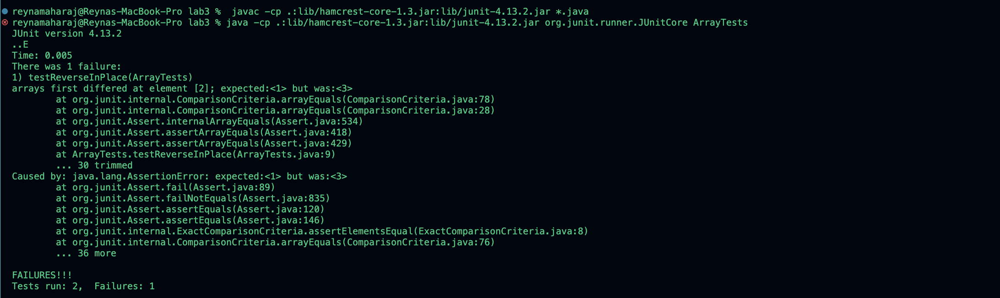
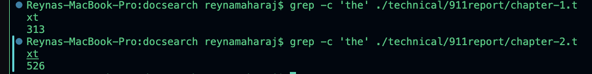
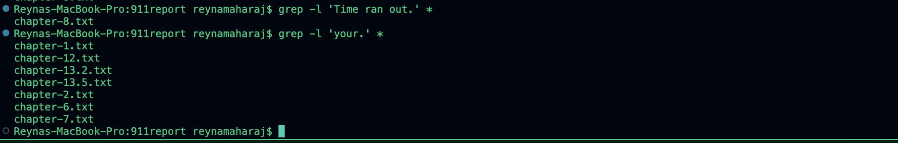

# CSE15L Lab Report 3
## Part 1- Bugs

1. Failure-inducing: JUNIT Test and Original Associated Code
   
~~~
   public class ArrayExamples {
       static void reverseInPlace(int[] arr) {
           for(int i = 0; i < arr.length; i += 1) {
               arr[i] = arr[arr.length - i - 1];
         }
      }
   }

   // JUnit Test
   @Test 
   public void testReverseInPlace() {
       int[] input1 = { 1, 2, 3 };
       ArrayExamples.reverseInPlace(input1);
       Assert.assertArrayEquals(new int[]{ 3, 2, 1 }, input1);
   }
~~~

 
 2. Non failure-inducing JUNIT Test and Original Associated Code.

These tests are both on failure-inducing JUNIT Test. At this point in the steps, the `reverseInPlace` method in `ArrayExamples` is producing one of the tests to fail and one of these tests to pass.
~~~
public class ArrayTests {
  @Test
	public void testReverseInPlace() {
    int[] input1 = { 1, 2, 3};
    ArrayExamples.reverseInPlace(input1);
    Assert.assertArrayEquals(new int[]{ 3, 2, 1 }, input1);

	}

  @Test
	public void testReverseInPlace2() {
    int[] input1 = { 1};
    ArrayExamples.reverseInPlace(input1);
    Assert.assertArrayEquals(new int[]{ 1 }, input1);

	}
~~~

3.

This code runs the two tests, one of them fails and one of them passes. The one that fails is the `testReverseInPlace`. The test that passes is the `testReverseInPlace2`. It passes because there is only one element in the array, so there aren't any numbers to incorrectly sort by. 

4.
Before-and-after code changes are required to fix it, by correctly swapping
 Before

~~~

    public class ArrayExamples {
      static void reverseInPlace(int[] arr) {
        for(int i = 0; i < arr.length; i += 1) {
          arr[i] = arr[arr.length - i - 1];
        }
    }
}
~~~

After
~~~
         public class ArrayExamples {
            public static void reverseInPlace(int[] array) {
                for (int i = 0; i < array.length / 2; i++) {
                    int temp = array[i];
                    array[i] = array[array.length - 1 - i];
                    array[array.length - 1 - i] = temp;
                }
            }
    }
~~~

5.Why the fix addresses the issue?
The issue with the code that caused the fail-inducing test was that it was swapping the element in the array with the entire array. In other words, it was undoing the swapping that it was doing, causing the array to remain the same. The after code addresses the issue because it correctly reverses the array in place, which is the purpose of the method. It correctly implements the `reverseInPlace` method by swapping each element with its corresponding element from the end of the array. 

## Part 2- Researching Commands 
Choice of command: `grep` 

`grep -c`

- The `grep -c` command is useful for finding the frequency of the patterns and or words in a file and then printing the count of the lines that match. The `grep -c 'the' ./technical/911report/chapter-1.txt` command searches for the frequency of the string, 'the', in the `chapter-1.txt` file, showing that the word is used in the file 313 times. The `grep -c 'the' ./technical/911report/chapter-2.txt` command searches for the frequency of the string, 'the', in the `chapter-1.txt` file, showing that the word is used in the files 526 times. 

`grep -h` 

- The `grep -h`  command is used to display the matched string in a file. It is useful for focusing on the content in a file and checking its contents. The `grep -h 'COUNTERTERRORISM EVOLVES' chapter-3. txt` command searches for the string 'COUNTERTERRORISM EVOLVES' in the chapter-3.txt file. Since it is in the file, it returns the string. The `grep -h '"WE HAVE SOME PLANES"' ./technical/911report/chapter-1. txt` command searches for the string "WE HAVE SOME PLANES" in the chapter-1.txt file. Since it is in the file, it returns the string.

  
`grep -n`

- The `grep -n` command searches for a specific pattern and then prints the corresponding line number. It is useful for locating contents in a file. The command `grep -n 'Time ran out.' chapter-8. txt` searches for where the string 'Time ran out' is located in the `chapter-5.txt` file. It prints 1034 because that is the line where 'Time ran out' is located. The command `grep -n 'AL QAEDA AIMS AT THE AMERICAN HOMELAND' chapter-5.txt` searches for where the string 'AL QAEDA AIMS AT THE AMERICAN HOMELAND' is located in the `chapter-5.txt`. It prints 4 because that is the line where 'AL QAEDA AIMS AT THE AMERICAN HOMELAND' is located.

`grep -l`

- The `grep -l` command prints the filenames which contain the given contents. It is useful for locating which files contain such patterns and or content. It is especially useful if you aren't sure which file it may be located in, allowing for a more encompassing search. 
The `grep -l 'Time ran out.' *` is searching through all the files for the location of 'Time ran out.', and lets the user know that it is in `chapter-8.txt`. The `grep -l 'your.' *` is searching through all the files for the location of 'your.', and lets the user know that it is in the files; `chapter-1.txt`, `chapter-12.txt`,  `chapter-13.2.txt`, `chapter-13.5.txt`, `chapter-2.txt`, `chapter-6.txt`, and `chapter-7.txt`.

Source for obtaining `grep` commands: geeksforgeeks.org

- Title Page: grep command in Unix/Linux
 
- Link: https://www.geeksforgeeks.org/grep-command-in-unixlinux/
