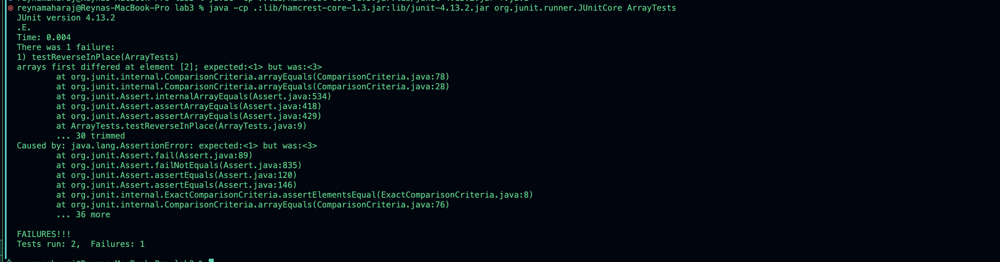

## Part 1- Bugs


1. 
```
{

@Test 
public void testReverseInPlace() {
    int[] input1 = { 1, 2, 3 };
    ArrayExamples.reverseInPlace(input1);
    Assert.assertArrayEquals(new int[]{ 3, 2, 1 }, input1);
}
}
```


2.
```
}@Test
public void testReversed() {
    int[] input = {1, 2, 3};
    Assert.assertArrayEquals(new int[]{3, 2, 1}, ArrayExamples.reversed(input));
}
}
```

3.

