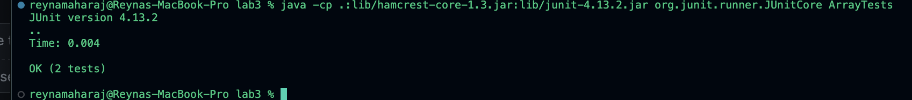

# CSE15L Lab Report 3
## Part 1- Bugs


1. Failure-inducing: JUNIT Test and Original Associated Code
```

public class ArrayExamples {
    static void reverseInPlace(int[] arr) {
        for(int i = 0; i < arr.length; i += 1) {
            arr[i] = arr[arr.length - i - 1];
        }
    }
}

// JUnit Test
@Test 
public void testReverseInPlace() {
    int[] input1 = { 1, 2, 3 };
    ArrayExamples.reverseInPlace(input1);
    Assert.assertArrayEquals(new int[]{ 3, 2, 1 }, input1);
}

```

2.
Not failure-inducing JUNIT Test and Original Associated Code
```

public class ArrayExamples {
    public static int[] reversed(int[] array) {
        int[] reversedArray = new int[array.length];
        for(int i = 0; i < array.length; i++) {
            reversedArray[i] = array[array.length - i - 1];
        }
        return reversedArray;
    }
}

// JUnit Test
@Test
public void testReversed() {
    int[] input = {1, 2, 3};
    Assert.assertArrayEquals(new int[]{3, 2, 1}, ArrayExamples.reversed(input));
}

```


3. 


4. Before-and-after code change required to fix it

   Before
```

    public class ArrayExamples {
      static void reverseInPlace(int[] arr) {
        for(int i = 0; i < arr.length; i += 1) {
          arr[i] = arr[arr.length - i - 1];

```


After
```

         public class ArrayExamples {
            public static void reverseInPlace(int[] array) {
                for (int i = 0; i < array.length / 2; i++) {
                int temp = array[i];
                array[i] = array[array.length - 1 - i];
                array[array.length - 1 - i] = temp;

```

Screenshot proving the bug was fixed for reference 


5. Why the fix addresses the issue?
This fix adresses the issue because it correctly reverses the array in place, which is the purpose of the method. It correctly implements the `reverseInPlace` method by swapping each element with its corresponding element from the end of the array.


## Part 2- Researching Commands 

   
